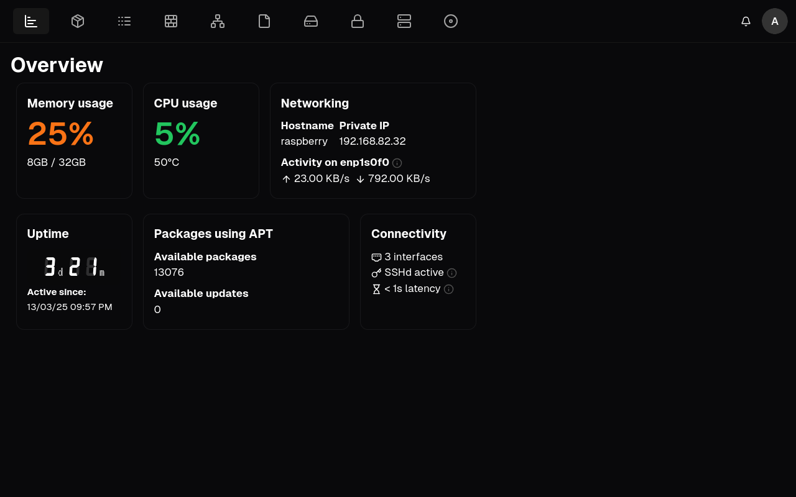

<h3 align="center">Home server administration with batteries included</h3>

## 💡 Which problems does Zentrox solve?

Zentrox helps you with the administration of your home server and lab devices.
It provides you with important and helpful tools for managing your device.

## 🎯 Features

- System statistics
- Package managing
- Firewall overview ([UFW](https://de.wikipedia.org/wiki/Uncomplicated_Firewall) at the time)
- Encrypted file store
- File sharing (FTPS at the time)
- Block device overview

*Zentrox is still being developed and features listed above are still being developed*

## 🛠️ Installation
**Zentrox is not yet intended for active use, but for testing.**
Zentrox has the following requirements
- OpenSSL
- Uncomplicated Firewall
- Python 3.11+
- pacman/apt/dnf
- Node (only for self-building)
- Cargo (only for self-building)

Zentrox can be installed in one of the following two ways:
### Pre-build binaries
As soon as Zentrox is released for the first time, I will upload pre-build releases to the [Releases](https://github.com/Wervice/zentrox/releases) page on GitHub.
1. Download the correct version for your computers CPU architecture. Zentrox only supports Linux at the time.
2. The pre-build release folder than contains the executable, static files and a `install.bash` file.
3. Install Zentrox by running the bash file: `bash install.bash`.
4. The installer will guide you through the process of setting up Zentrox on your device.
5. After installing Zentrox, the binary and static files are moved to `~/zentrox`.
6. Run the binary `zentrox`.
7. Zentrox will then be served on `https://localhost:8080`.

### Building Zentrox yourself
To build Zentrox yourself, please follow the instructions bellow:
1. Clone the Zentrox repository
`git clone https://github.com/wervice/zentrox`
2. To prepare building the frontend, please navigate to `frontend/` and run `npm i`. This command may take a while to finish.
3. When all Node dependencies are installed, navigate to `backend/` and run `bash update_frontend.bash` to build the frontend.
4. After the frontend is build, run `bash build.bash`. This builds the backend and creates a `dist/` folder in `backend/`.
5. You can now navigate to the dist folder and run `install.bash`. 
6. See Pre-build binaries above for more instructions on how to use the installer.

### Post installation
While installing Zentrox, `install.bash` has done the following changes to your computer:
1. Adding a UFW rule to allow Zentrox to be accessed from outside your computer. The rule allows Port 8080 for IPv4 and IPv6 traffic.
2. Creating two directories in your home directory: `~/zentrox/` and `~/zentrox_data/`.
> [!WARNING]  
> The ~/zentrox_data/ directory also contains vault files and other sensitive information.
> This directory and its contents should not be modified or deleted, as doing so may break Zentrox.

#### Removing Zentrox
Zentrox can be removed by reverting the changes mentioned above and by deleting the `~/zentrox_data/` and `~/zentrox/` directory.
Doing so, will also remove your Zentrox vault files.

## ✏️ Contributing

You can contribute to this project in several different ways.  
I am glad about pull requests, issues and feedback.
You can try Zentrox at any time, but I recommend using a pre-build release as Zentrox is actively being developed on and the latest code on GitHub may not be tested yet.

## 📖 Credits & Legal

Zentrox is released under [Apache 2.0](https://github.com/Wervice/Codelink?tab=Apache-2.0-1-ov-file#readme).
The Zentrox frontend uses NextJS by Vercel, Shadcn and Lucide Icons.
The Zentrox backend and installer use OpenSSL as command line tools and/or linked libraries.
You can find more under [`legal/`](legal/) and THIRD_PARTY_LICENSES.md.
