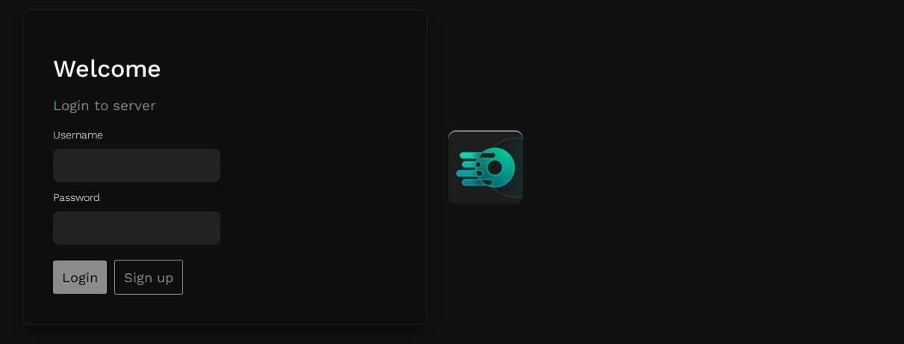

<br>
<div align="center">

</div>

<h3 align="center">Easy server admin and setup</h3>


[](https://x.com/intent/post?text=https%3A%2F%2Fgithub.com%2Fwervice%2Fzentrox)

> [!IMPORTANT]
> ⚠️  Zentrox is a work in progress and not done. It may still change before the first release.

## 💡 Which problems does Zentrox solve?

Zentrox helps you with the administration of your home server.
It will provide you with the most important tools for managing your device.
The installation is very fast and doesn't require great background knowledge.

## 🎯 Features

- _File Sharing Protocols_ (Supports FTP)
- Package manager (Install and remove packages)
- _Vault_ (Host your own encrypted file store)
- System overview (See system statistics)
- _Web Shell_ (Remote control the system using a shell)
- File Manager (Remove, rename and download files)
- TLS encrypted (Uses HTTP**S** with self signed certificates)

## 🛠️ Installation

> [!IMPORTANT]
> Zentrox is a work in progress.
> At the time, many parts of the application are not done and properly tested.
> If you want to see, what the current state is, you can test it using the commands bellow.
> Please do not ignore any disclaimers, as you may break your system.
> You can also run it in a VM.

Zentrox only supports Linux at the time.
You can use the script bellow to install Zentrox on your system.  
It will auto generate a .key and .crt file for HTTPS support.
If you already have a .key and .crt, please copy it to the folder and call it selfsigned.crt / selfsigned.key.

### Requirements

- Node.JS (Version 22+)
- Python (Version 3.11+)
- NPM
- Pip3
- Go
- Linux (OpenSUSE is not supported at the time)
- OpenSSL

### Installing

1. Run the following command in your terminal:
   `curl -fsSL https://raw.githubusercontent.com/Wervice/zentrox/main/install.bash -o zentrox_installer.bash; bash zentrox_installer.bash`
2. Follow the installer.
3. Run `cd ~/zentrox; node zentrox.js` to get started.
4. Go to `https://localhost:3000` and login with your newly configured admin username and password.

## 🗃️ Usage

After rebooting the server or closing Zentrox, you can restart it using:

```bash
cd ~/zentrox # Go to Zentrox code folder
node index.js # Start zentrox
```

You can now login to Zentrox using your admin credentials.

## 🗑️ Removing

You can remove Zentrox by deleting the `zentrox` folder located in your home folder.  
If you also want to erase all user & admin data, you can remove zentrox_data.
**zentrox_data** also contains Zentrox Vault.

> [!IMPORTANT]
> After your removed your data, it can only be restored using a utility like `testdisk`

## ✏️ Contributing

You can contribute this project in many ways. I am happy about any feedback.  
If you found a bug, please open an issue and I will try to fix it.  
Also, you are very welcome to **star** this project.

## ⭐Star History

[](https://star-history.com/#wervice/zentrox&Date)

#### Support this project with a Star.

## 📖 Legal

Zentrox is released under [Apache 2.0](https://github.com/Wervice/Codelink?tab=Apache-2.0-1-ov-file#readme)

Zentrox uses/requires the following resources:

- Unicons (Outline) by [IconScout](https://github.com/Iconscout/unicons)
- Work Sans Font [OFL](https://github.com/weiweihuanghuang/Work-Sans/blob/master/OFL.txt)
