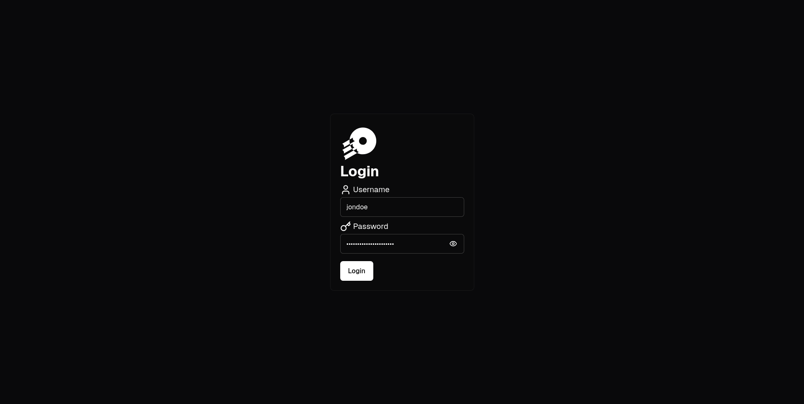
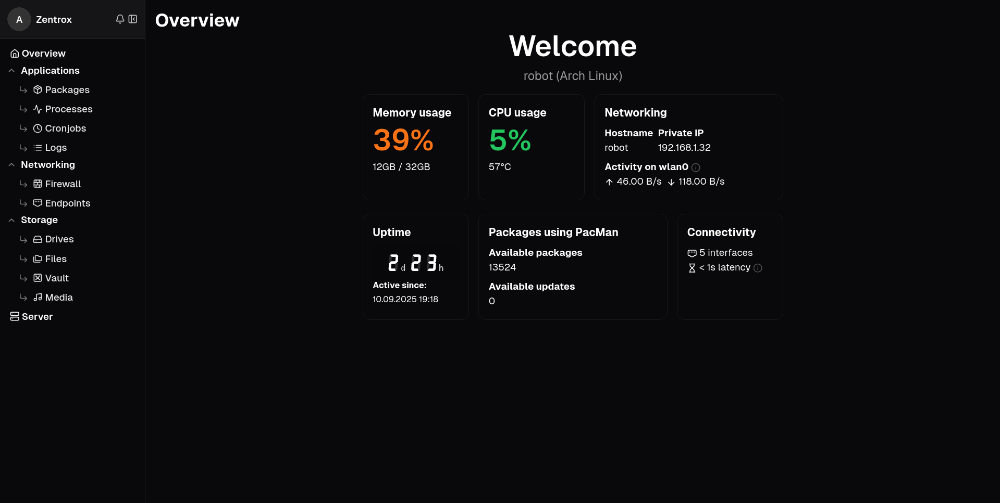
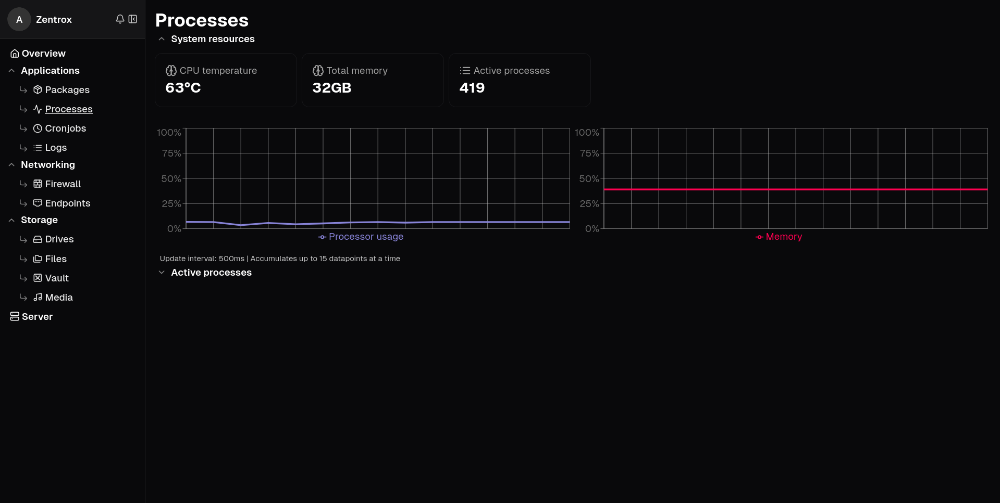

    <picture>
      
    </picture>

A powerful server administration tool

---

# This is a work in progress - Code may not work as expected - Use with caution

## Features and use-case
Zentrox helps with controlling and surveiling Linux home servers and computers. It is equipped with tools designed for basic and advanced OS administration, file managing or device-specific network management.

Its features include:
- Package installation, removal and updating using `apt`, `dnf` and `pacman`
- Network interface and route control
- System log viewing using `journalctl`
- Firewall web interface for [`ufw`](https://wiki.ubuntu.com/UncomplicatedFirewall)
- File management
- Storage device viewing
- General device statistics
- Integrated media viewer (disabled by default)
- Secure connection over HTTP
- 2FA using OTP

## Screenshots
Just some pictures:

## Installation

Please refer to the [User documentation](./docs/user.md) for installation instructions and make sure your targeted device satisfies the requirements.
### Requirements
- Linux
- APT, DNF or PacMan (package management)
- Journalctl (only for logging)
- Sudo (permissions management)
- UFW (only for firewall)
> [!WARNING]
> If a requirement is not met, Zentrox may still work largely as expected but may run into issues when trying to accomplish certain tasks.

